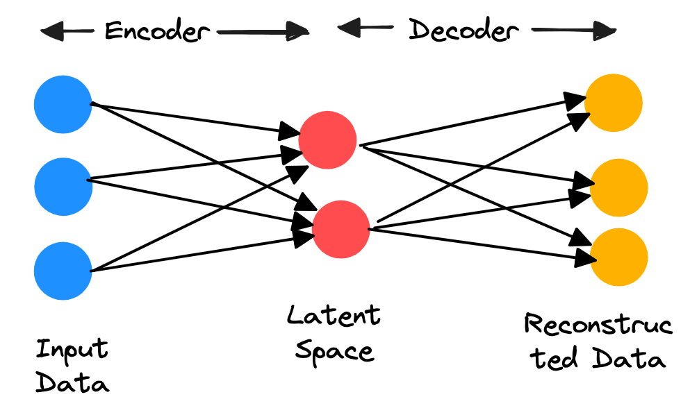
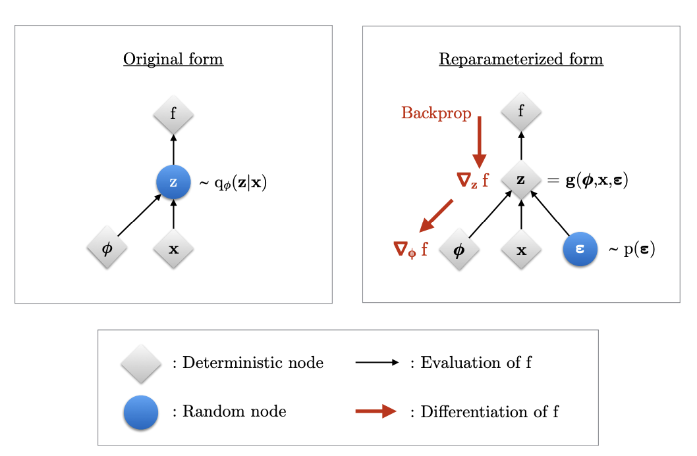
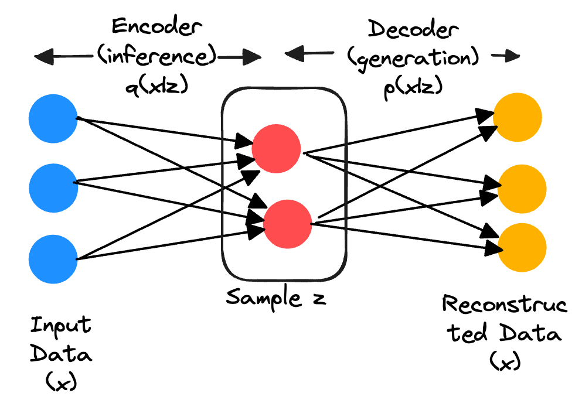
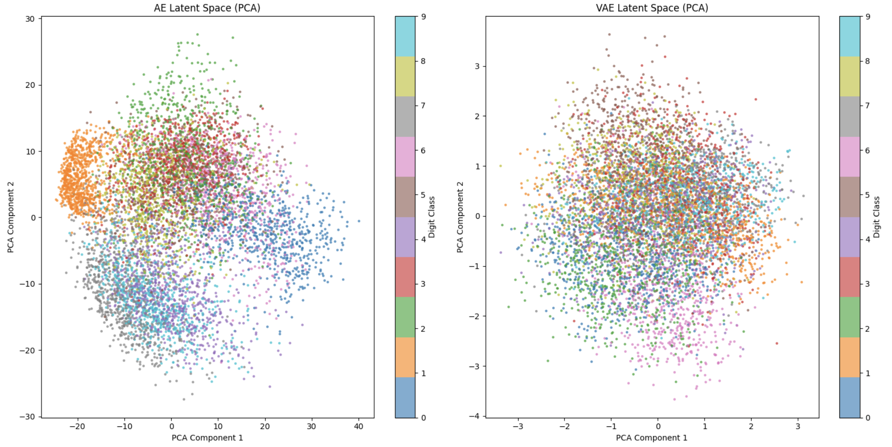
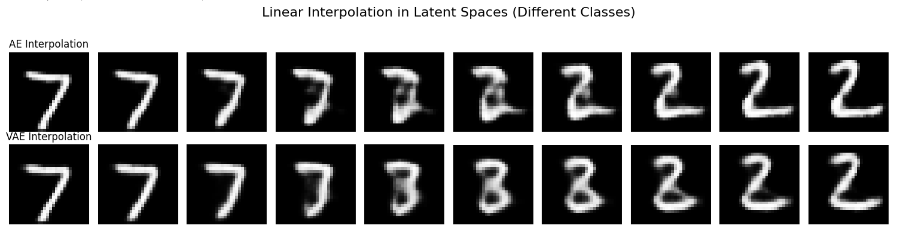
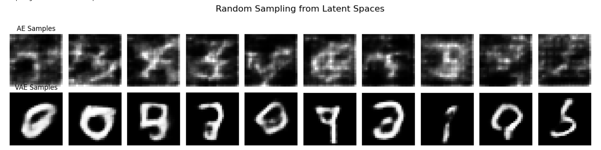

Modern machine learning models—from autoencoders to large language models—rely on the idea of latent representations. These are compact, abstract encodings of data that capture structure, meaning, or features without directly mirroring the raw input. A latent representation is a vector (or set of vectors) in a hidden space learned from data, which encodes the input in a way that makes downstream tasks easier. Latent spaces often have meaningful geometric properties like clustering of similar items together, meaningful semantic linearity (in case of word embeddings `king - man + woman ≈ queen`), or the manifold hypothesis which suggests that data lies on a much lower dimensional manifold embedded in latent space.

To learn such representations in an unsupervised way, we need models that can compress data into these lower-dimensional manifolds while still preserving its essential information. This is precisely where autoencoders come into play. They are designed to learn efficient latent encodings by training a neural network to reconstruct its own input.

## Autoencoders (AE)

Let's assume that our data is represented by $x \in \mathbb{R}^D$, and latent variable is denoted as $z \in \mathbb{R}^d$, where $d \ll D$.
A standard autoencoder (AE) consists of two neural network modules:

**Encoder**: Learns the parametrized function $f_\phi : \mathbb{R}^D \to \mathbb{R}^d$, which maps the high-dimensional input data to a low-dimensional latent representation:

$$z = f_\phi(x)$$

**Decoder**: Learns the parametrized function $g_\theta : \mathbb{R}^d \to \mathbb{R}^D$, which reconstructs the input from the latent code:

$$\hat{x} = g_\theta(z)$$

The network is trained to minimize the reconstruction error, i.e., how close the reconstructed $\hat{x}$ is to the original $x$. A common choice of loss function is the Mean Squared Error (MSE):

$$\mathcal{L}_{AE}(x, \hat{x}) = \mathbb{E}_{x \sim p_{data}(x)} \left\| x - g_\theta(f_\phi(x)) \right\|^2$$

## Variational Autoencoders (VAE)

The vanilla autoencoder maps an input $x$ to a deterministic point $z$ in the latent space. As a result, the latent space learnt is discontinuous, patchy and not semantically meaninful. A deterministic mapping means you cannot simply sample a random point from the latent space and expect the decoder to produce a realistic, new sample that resembles the training data. The decoder only works well for the specific points $z$ that came from the encoder.

A variational encoder solves the above autoencoder issues, learns a meaningful latent space by imposing a prior on the latent $z$, and doing variational inference for the posterior, encouraging the latent representations to be continuous, smooth, and generative.

### Evidence Lower Bound (using Jensen's inequality)

Let $p(x)$ represent the true data distribution, and we have samples $x^{(i)} \sim p(x)$. We would like to model $p_\theta(x)$ to approximate $p(x)$. Formally, we would like to solve:

$$\theta^* = \arg\max_\theta \mathbb{E}_{x \sim p(x)}\left[\log p_\theta(x)\right]$$

Since our underlying assumption that the data $x$ has been generated from a latent variable $z$, we express the data likelihood $\log p_\theta(x)$ as marginalization over all possible latent codes ([Luo, 2022](https://doi.org/10.48550/arXiv.2208.11970)):

$$\log p_\theta(x) = \log \int p_\theta(x|z)\, p(z)\, dz$$

Computing the above integral is **intractable**, especially when $p_\theta(x|z)$ is a complex neural network, therefore we introduce an approximate posterior $q_\phi(z|x)$ (the encoder) and optimize the Evidence Lower Bound (ELBO).

$$
\begin{aligned}
\log p_\theta(x) &= \log \int q_\phi(z|x) \frac{p_\theta(x|z)p(z)}{q_\phi(z|x)}\, dz && \text{(multiply/divide by } q_\phi(z|x)) \\
&= \log \mathbb{E}_{z \sim q_\phi(z|x)}\left[\frac{p_\theta(x|z)p(z)}{q_\phi(z|x)}\right] && \text{(definition of expectation)}
\end{aligned}
$$

By [Jensen's inequality](https://en.wikipedia.org/wiki/Jensen%27s_inequality) (since log is concave, $\log \mathbb{E}[X] \geq \mathbb{E}[\log X]$):

$$\log p_\theta(x) \geq \mathbb{E}_{z \sim q_\phi(z|x)}\left[\log \frac{p_\theta(x|z)p(z)}{q_\phi(z|x)}\right] \quad \text{(ELBO)}$$

Thus, we have:

$$\log p_\theta(x) \geq \text{ELBO}$$

The above derivation of ELBO shows that it's a lower bound on the likelihood, but it doesn't give insight on the tightness of bound, and why maximizing it will maximize likelihood $\log p_\theta(x)$. That's where an alternate derivation is more helpful.

### Evidence Lower Bound (alternate derivation)

Starting with the log-likelihood $\log p_\theta(x)$, we can decompose it as ([Kingma, 2017](https://pure.uva.nl/ws/files/17891313/Thesis.pdf)):

$$
\begin{aligned}
\log p_\theta(x) &= \log p_\theta(x) \int q_\phi(z|x)\, dz && \left(\int q_\phi(z|x)\, dz = 1\right) \\
&= \int q_\phi(z|x) \log p_\theta(x)\, dz \\
&= \mathbb{E}_{q_\phi(z|x)}\left[\log p_\theta(x)\right] \\
&= \mathbb{E}_{q_\phi(z|x)}\left[\log \frac{p_\theta(x,z)}{p_\theta(z|x)}\right] && \text{(Conditional probability definition)} \\
&= \mathbb{E}_{q_\phi(z|x)}\left[\log \frac{p_\theta(x,z)}{q_\phi(z|x)} \cdot \frac{q_\phi(z|x)}{p_\theta(z|x)}\right] && \left(\tfrac{q_\phi(z|x)}{q_\phi(z|x)} = 1\right) \\
&= \underbrace{\mathbb{E}_{q_\phi(z|x)}\left[\log \frac{p_\theta(x,z)}{q_\phi(z|x)}\right]}_{=\, \mathcal{L}_{\theta,\phi}(x)\ \text{(ELBO)}} + \underbrace{\mathbb{E}_{q_\phi(z|x)}\left[\log \frac{q_\phi(z|x)}{p_\theta(z|x)}\right]}_{=\, D_{KL}(q_\phi(z|x)\, \|\, p_\theta(z|x))}
\end{aligned}
$$

Since second term $D_{KL} \geq 0$, the first term (ELBO) is a lower bound on the likelihood, or evidence, that is, $\mathcal{L}_{\theta,\phi}(x) \leq \log p_\theta(x)$. Interesting, the KL divergence $D_{KL}(q_\phi(z|x)\, \|\, p_\theta(z|x))$ determines the two distances:

1. KL divergence of the approximate posterior $q_\phi(z|x)$ from the true posterior $p_\theta(z|x)$.
2. Gap between ELBO $\mathcal{L}_{\theta,\phi}(x)$ and likelihood $\log p_\theta(x)$, known as the tightness of bound. The better approximate posterior is closer to true posterior, lower the KL divergence, the tigher the bound.

There's another equivalent way of writing ELBO as:

$$
\begin{aligned}
\mathcal{L}_{\theta,\phi}(x) &= \mathbb{E}_{q_\phi(z|x)}\left[\log \frac{p_\theta(x,z)}{q_\phi(z|x)}\right] \\
&= \mathbb{E}_{q_\phi(z|x)}\left[\log \frac{p_\theta(x|z)p(z)}{q_\phi(z|x)}\right] && \text{(assuming fixed prior } p(z)) \\
&= \underbrace{\mathbb{E}_{q_\phi(z|x)}\left[\log p_\theta(x|z)\right]}_{\text{Reconstruction term}} - \underbrace{D_{KL}(q_\phi(z|x)\, \|\, p(z))}_{\text{Regularization term}}
\end{aligned}
$$

### VAE Optimization

For VAEs, the optimization objective is ELBO. Maximization of ELBO $\mathcal{L}_{\theta,\phi}(x)$ w.r.t. the paramters $\theta$ and $\phi$ will concurrently optimize the two things we are interested in:

1. Maximizing ELBO $\mathcal{L}_{\theta,\phi}(x)$ w.r.t. $\theta$ approximately maximizes $\log p_\theta(x)$. Since $\nabla_\theta \mathcal{L}_{\theta,\phi}(x) \approx \nabla_\theta \log p_\theta(x)$ if $q_\phi(z|x) \approx p_\theta(z|x)$, where $\nabla_\theta$ represents the gradient w.r.t. $\theta$. If $D_{KL}(q_\phi(z|x)\, \|\, p_\theta(z|x))$ becomes 0, then its gradient will vanish.
2. Maximizing ELBO $\mathcal{L}_{\theta,\phi}(x)$ w.r.t. $\phi$ minimizes the KL divergence $D_{KL}(q_\phi(z|x)\, \|\, p_\theta(z|x))$, because the likelihood $\log p_\theta(x)$ is a constant w.r.t. $\phi$.

Since ELBO allows joint optimization w.r.t. all parameters ($\theta$ and $\phi$) using stochastic gradient descent, we can randomly initialize $\theta$ and $\phi$, and optimize till convergence ([Kingma, 2017](https://pure.uva.nl/ws/files/17891313/Thesis.pdf)).

Good unbiased gradient estimators $\tilde{\nabla}_{\theta,\phi} \mathcal{L}_{\theta,\phi}(x)$ exist, such that we can perform minibatch SGD.

**Gradients w.r.t. $\theta$:** Unbiased gradients of the ELBO w.r.t. the generative model parameters are simple to obtain:

$$
\begin{aligned}
\nabla_\theta \mathcal{L}_{\theta,\phi}(x) &= \nabla_\theta \mathbb{E}_{q_\phi(z|x)}\left[\log p_\theta(x,z) - \log q_\phi(z|x)\right] \\
&= \mathbb{E}_{q_\phi(z|x)}\left[\nabla_\theta \left(\log p_\theta(x,z) - \log q_\phi(z|x)\right)\right] && (q_\phi(z|x) \text{ does not depend on } \theta) \\
&\approx \nabla_\theta \left(\log p_\theta(x,z) - \log q_\phi(z|x)\right) \\
&= \nabla_\theta \left(\log p_\theta(x|z)\right)
\end{aligned}
$$

where $z$ is sampled from $q_\phi(z|x)$.

**Gradients w.r.t. $\phi$:** Unbiased gradients w.r.t. the variational parameters $\phi$ are more difficult to obtain, since the ELBO's expectation is taken w.r.t. the distribution $q_\phi(z|x)$, which is a function of $\phi$. In general:

$$
\nabla_\phi \mathcal{L}_{\theta,\phi}(x) = \nabla_\phi \mathbb{E}_{q_\phi(z|x)}\left[\log p_\theta(x,z) - \log q_\phi(z|x)\right] \neq \mathbb{E}_{q_\phi(z|x)}\left[\nabla_\phi \left(\log p_\theta(x,z) - \log q_\phi(z|x)\right)\right]
$$

The key challenge is that we cannot simply move the gradient inside the expectation when the distribution itself depends on $\phi$.

#### Reparameterization trick

The key idea is to express the random variable $z \sim q_\phi(z|x)$ as a differentiable (and invertible) transformation of another random variable $\epsilon$:

$$z = g(\epsilon, \phi, x)$$

where the distribution of $\epsilon$ is independent of $x$ or $\phi$.

In the original form (left in Figure 2), we cannot differentiate $f$ w.r.t. $\phi$ because we cannot directly backpropagate gradients through the random variable $z$. By 'externalizing' the randomness through the reparameterization, we can compute gradients $\nabla_\phi f$ ([Kingma, 2017](https://pure.uva.nl/ws/files/17891313/Thesis.pdf)).

With the reparameterization trick, we can now compute gradients w.r.t. both $\theta$ and $\phi$. The ELBO gradient becomes:

$$
\begin{aligned}
\nabla_{\theta,\phi} \mathcal{L}_{\theta,\phi}(x) &= \nabla_{\theta,\phi} \mathbb{E}_{q_\phi(z|x)}\left[\log p_\theta(x,z) - \log q_\phi(z|x)\right] \\
&= \nabla_{\theta,\phi} \mathbb{E}_{p(\epsilon)}\left[\log p_\theta(x, g(\epsilon,\phi,x)) - \log q_\phi(g(\epsilon,\phi,x)|x)\right] && \text{(change of variables)} \\
&= \mathbb{E}_{p(\epsilon)}\left[\nabla_{\theta,\phi}\left(\log p_\theta(x, g(\epsilon,\phi,x)) - \log q_\phi(g(\epsilon,\phi,x)|x)\right)\right] \\
&\approx \nabla_{\theta,\phi}\left(\log p_\theta(x,z) - \log q_\phi(z|x)\right)
\end{aligned}
$$

where $z = g(\epsilon, \phi, x)$ and $\epsilon \sim p(\epsilon)$. The key insight is that since $p(\epsilon)$ is independent of $\phi$, we can move the gradient inside the expectation, enabling efficient gradient computation via Monte Carlo sampling.

#### Special Case: Gaussian Posterior and Fixed Prior

In practice, we assume a Gaussian approximate posterior $q_\phi(z|x) = \mathcal{N}(\mu_\phi(x), \sigma_\phi^2(x) I)$ and a Gaussian prior $p(z) = \mathcal{N}(0, I)$.

The reparameterization of $z$ is:

$$z = \mu_\phi(x) + \sigma_\phi(x) \odot \epsilon, \quad \epsilon \sim \mathcal{N}(0, I)$$

where $\mu_\phi(x)$ and $\sigma_\phi(x)$ are predicted from the encoder.

Recall that the ELBO is:

$$\mathcal{L}_{\theta,\phi}(x) = \mathbb{E}_{q_\phi(z|x)}\left[\log p_\theta(x|z)\right] - D_{KL}(q_\phi(z|x)\, \|\, p(z))$$

For this scenario, the KL divergence has a closed-form solution:

$$
\begin{aligned}
D_{KL}(q_\phi(z|x)\, \|\, p(z)) &= D_{KL}\left(\mathcal{N}(\mu, \sigma^2 I)\, \|\, \mathcal{N}(0, I)\right) \\
&= \frac{1}{2}\sum_{j=1}^{d}\left(\mu_j^2 + \sigma_j^2 - \log(\sigma_j^2) - 1\right)
\end{aligned}
$$

The reconstruction term depends on the data likelihood. For continuous data, we often use:

$$\mathbb{E}_{q_\phi(z|x)}\left[\log p_\theta(x|z)\right] \approx -\|x - \hat{x}\|_2^2$$

where $\hat{x} = g_\theta(z)$ is the decoder output.

**Training Loss:** The final VAE training loss for a single datapoint is:

$$\mathcal{L}_{VAE}(x) = \|x - g_\theta(z)\|_2^2 + \frac{1}{2}\sum_{j=1}^{d}\left(\mu_j^2 + \sigma_j^2 - \log(\sigma_j^2) - 1\right)$$

#### Training Procedure

1. **Initialize**: Randomly initialize encoder parameters $\phi$ and decoder parameters $\theta$
2. **Repeat until convergence**:
   - Sample a minibatch of data $\{x^{(1)}, x^{(2)}, \ldots, x^{(M)}\}$ from the dataset
   - For each $x^{(i)}$ in the minibatch:
     - **Encode**: Compute $\mu_\phi(x^{(i)})$ and $\sigma_\phi(x^{(i)})$ using the encoder network
     - **Sample**: Draw $\epsilon^{(i)} \sim \mathcal{N}(0, I)$
     - **Reparameterize**: Compute $z^{(i)} = \mu_\phi(x^{(i)}) + \sigma_\phi(x^{(i)}) \odot \epsilon^{(i)}$
     - **Decode**: Compute reconstruction $\hat{x}^{(i)} = g_\theta(z^{(i)})$ using the decoder network
     - **Compute loss**: $\mathcal{L}_{VAE}(x^{(i)}) = \|x^{(i)} - \hat{x}^{(i)}\|_2^2 + \frac{1}{2}\sum_{j=1}^{d}\left(\mu_j^2 + \sigma_j^2 - \log(\sigma_j^2) - 1\right)$
   - **Compute minibatch loss**: $\mathcal{L}_{batch} = \frac{1}{M}\sum_{i=1}^{M} \mathcal{L}_{VAE}(x^{(i)})$
   - **Update parameters**: $\theta \leftarrow \theta - \eta \nabla_\theta \mathcal{L}_{batch}$, $\phi \leftarrow \phi - \eta \nabla_\phi \mathcal{L}_{batch}$ where $\eta$ is the learning rate.

### Training VAE on MNIST

For the MNIST dataset ([LeCun et al., 1998](https://huggingface.co/datasets/ylecun/mnist)), we train both an AE and VAE, using a convolutional architecture for both encoder and decoder, and compare the differences in the latent space.

**Visualization of Latent Space:** In Figure 4, we visualize the latent space for the trained models after running inference for 10k images in the testset, applying PCA ([Wikipedia, 2025](https://en.wikipedia.org/wiki/Principal_component_analysis)) on the latents, and plotting the first two principal components. We can see that VAE latent space lies uniformly in [-3, 3] while AE latent space is discontinous and patchy, as expected. We had hoped to see clearer clusters w.r.t. digits, but it's possible that we don't see them due to projecting to lower 2-dims via PCA in both AE and VAE.

**Interpolation Quality:** To evaluate the smoothness of the latent space, we perform linear interpolation between two encoded points in the latent space and decode the intermediate points. Figure 5 shows that VAE produces smooth transitions between digits when interpolating between two points representing digits 7 and 2, with intermediate points resembling digits 3 and 8, while AE generates unrealistic intermediate reconstructions due to its discontinuous latent space.

**Generative Sampling:** To show that latent space of VAE is semantically meaningful, and allows the model to be generative, we sample random points from the latent space and decode them. We sample $z \sim \mathcal{N}(0, I)$ from the prior, and then pass them through the decoder for both AE and VAE. Figure 6 demonstrates that VAE generates realistic digit samples from random latent codes, while AE fails to produce meaningful outputs since its latent space is not designed for random sampling.

Check out the [Colab notebook](https://colab.research.google.com/drive/1yY4R7y_WbxUJLhrsaXfLb1QKfsCipLFW?usp=sharing) for the implementation.

## References

- Kingma, D. P. (2017). *Variational Inference & Deep Learning: A New Synthesis* [Ph.D. thesis, University of Amsterdam]. https://pure.uva.nl/ws/files/17891313/Thesis.pdf
- LeCun, Y., Cortes, C., & Burges, C. J. C. (1998). *The MNIST Database of Handwritten Digits*. https://huggingface.co/datasets/ylecun/mnist
- Luo, C. (2022). *Understanding Diffusion Models: A Unified Perspective*. CoRR, abs/2208.11970. https://doi.org/10.48550/arXiv.2208.11970
- Wikipedia. (2025). *Principal component analysis — Wikipedia, The Free Encyclopedia*. https://en.wikipedia.org/wiki/Principal_component_analysis
